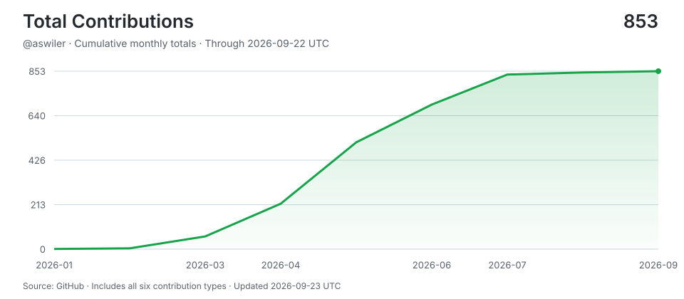

# aswiler

> Shipping with AI agents around the clock -- human hours for thinking, machine hours for doing.
> Stats auto-updated by [aidevops](https://aidevops.sh).

<!-- STATS-START -->
## Work with AI

| Metric | Yesterday | Prior 7 Days | Prior 28 Days | Prior 365 Days |
| --- | ---: | ---: | ---: | ---: |
| Screen time (Mac) | 23.9h | 109.4h | 116.3h | ~981h* |
| Interactive human attention | 8.2h | 42.7h | 67.0h | 245.5h |
| Interactive AI generation | 22.9h | 174.3h | 401.2h | 730.4h |
| Worker-classified human attention | 0.1h | 2.5h | 2.5h | 2.5h |
| Worker/headless AI generation | 6.8h | 23.7h | 119.6h | 1248.8h |
| Additive observed work | 37.9h | 242.5h | 589.7h | 2,226.7h |
| Interactive sessions | 19 | 94 | 122 | 326 |
| Worker sessions | 81 | 400 | 576 | 2,212 |

_Screen time from macos-pmset-display-assertions; collection status: ok. *365-day estimate uses observed calendar coverage._

_Periods are completed local calendar days ending at midnight; today is excluded._

_Human attention is unioned wall-clock time, so overlapping sessions are not double-counted. AI generation is additive machine work across sessions; it is not wall-clock concurrency._

_AI session 365-day totals cover 186 days of local assistant session history (not extrapolated)._

## AI Model Usage (last 30 days)

| Model | Requests | Input | Output | Cache read | Cache Hit-Rate % | Session Count | Session Hours |
| --- | ---: | ---: | ---: | ---: | ---: | ---: | ---: |
| gpt-5.6-sol | 35,710 | 140.7M | 6.7M | 4,796.4M | 97.1% | 200 | 404.2h |
| gpt-5.6-terra | 3,967 | 36.5M | 1.0M | 250.8M | 87.3% | 340 | 51.6h |
| gpt-5.6-luna | 2,934 | 31.6M | 881K | 312.1M | 90.8% | 165 | 95.1h |
| gpt-6-astra | 924 | 2.3M | 171K | 127.3M | 98.2% | 18 | 4.5h |
| gpt-6-luna | 1 | 36K | 31 | 0 | 0.0% | 1 | 0.0h |
| **Total** | **43,536** | **211.2M** | **8.8M** | **5,486.8M** | **96.3%** | **707** | **555.4h** |

_5,706.9M total tokens processed. 96.3% cache hit rate._

## AI Model Usage (all time)

| Model | Requests | Input | Output | Cache read | Cache Hit-Rate % | Session Count | Session Hours |
| --- | ---: | ---: | ---: | ---: | ---: | ---: | ---: |
| gpt-5.6-sol | 125,088 | 754.5M | 29.1M | 15,974.6M | 95.5% | 1,149 | 1,491.4h |
| gpt-5.5 | 10,005 | 86.4M | 3.0M | 1,139.4M | 93.0% | 218 | 68.6h |
| claude-opus-4-7 | 9,471 | 14K | 7.8M | 1,223.9M | 100.0% | 112 | 59.6h |
| gpt-5.6-luna | 8,693 | 74.5M | 2.2M | 985.0M | 93.0% | 277 | 135.8h |
| gpt-5.6-terra | 8,288 | 79.0M | 2.1M | 633.1M | 88.9% | 566 | 82.8h |
| gpt-5.3-codex-spark | 7,250 | 23.3M | 1.5M | 374.5M | 94.1% | 23 | 40.5h |
| claude-opus-4-6 | 6,273 | 7K | 3.9M | 1,092.3M | 100.0% | 119 | 30.0h |
| claude-opus-4-8 | 4,973 | 9K | 3.6M | 787.1M | 100.0% | 77 | 24.6h |
| grok-4.5 | 1,529 | 10.0M | 668K | 278.9M | 96.5% | 27 | 12.2h |
| gpt-6-astra | 924 | 2.3M | 171K | 127.3M | 98.2% | 18 | 4.5h |
| claude-sonnet-4-6 | 545 | 682 | 318K | 60.1M | 100.0% | 28 | 1.8h |
| gpt-5.6-terra-fast | 383 | 1.2M | 65K | 43.3M | 97.2% | 5 | 1.2h |
| gpt-5.3-codex | 289 | 3.1M | 82K | 18.5M | 85.4% | 13 | 0.9h |
| gpt-5.4 | 167 | 4.6M | 65K | 71.2M | 93.8% | 1 | 0.9h |
| big-pickle | 153 | 166K | 58K | 11.8M | 98.6% | 5 | 0.4h |
| mimo-v2-omni-free | 90 | 661K | 51K | 8.1M | 92.5% | 2 | 0.2h |
| claude-opus-4-5 | 39 | 81 | 28K | 1.7M | 100.0% | 4 | 0.2h |
| pool-account-management | 9 | 0 | 0 | 0 | 0.0% | 8 | 0.0h |
| gpt-5.5-pro | 7 | 0 | 0 | 0 | 0.0% | 6 | 0.0h |
| gpt-5.6-sol-pro | 2 | 0 | 0 | 0 | 0.0% | 2 | 0.0h |
| claude-haiku-4-5 | 1 | 3 | 49 | 0 | 0.0% | 1 | 0.0h |
| claude-opus-4-6-fast | 1 | 0 | 0 | 0 | 0.0% | 1 | 0.0h |
| gpt-6-luna | 1 | 36K | 31 | 0 | 0.0% | 1 | 0.0h |
| grok-build-0.1 | 1 | 0 | 0 | 0 | 0.0% | 1 | 0.0h |
| **Total** | **184,182** | **1,040.2M** | **55.1M** | **22,831.8M** | **95.6%** | **2,498** | **1,955.6h** |

_24,123.1M total tokens processed. 95.6% cache hit rate._
<!-- STATS-END -->

## Projects

- **[andrew-skills](https://github.com/aswiler/andrew-skills)** -- No description
- **[straw-hat-division](https://github.com/aswiler/straw-hat-division)** -- One Piece division math game in Catalan with card colection
## Connect

---

<!-- UPDATED-START -->
_Stats auto-updated 2026-09-22 23:05 UTC by [aidevops](https://aidevops.sh) pulse._
<!-- UPDATED-END -->

<!-- TOTAL-CONTRIBUTIONS-START -->

  <a href="https://commit-history.com/aswiler?metric=total" target="_blank" rel="noopener noreferrer">
    <picture>
      <source media="(prefers-color-scheme: dark)" srcset="assets/contributions/total-dark.svg" />
      
    </picture>
  </a>

[Verify on commit-history.com](https://commit-history.com/aswiler?metric=total) · [Chart data](assets/contributions/total.json)

Includes commits, issues, pull requests, reviews, repositories, and restricted contributions. Refreshed daily through the prior UTC day; commit-history.com may use a different refresh cutoff. GitHub controls link navigation—Ctrl/Cmd-click opens verification in a new tab.
<!-- TOTAL-CONTRIBUTIONS-END -->
