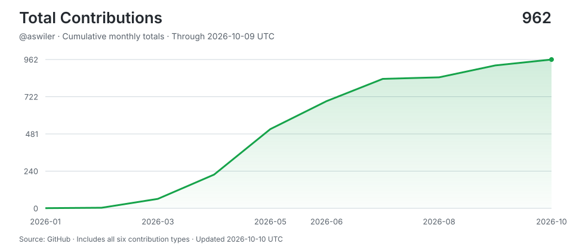

# aswiler

> Shipping with AI agents around the clock -- human hours for thinking, machine hours for doing.
> Stats auto-updated by [aidevops](https://aidevops.sh).

<!-- STATS-START -->
## Work with AI

| Metric | Yesterday | Prior 7 Days | Prior 28 Days | Prior 365 Days |
| --- | ---: | ---: | ---: | ---: |
| Screen time (Mac) | 16.4h | 108.6h | 273.1h | ~1418h* |
| Interactive human attention | 5.6h | 36.4h | 137.7h | 325.9h |
| Interactive AI generation | 33.7h | 221.3h | 630.7h | 1154.5h |
| Worker-classified human attention | 0.0h | 0.0h | 2.5h | 2.5h |
| Worker/headless AI generation | 6.6h | 49.9h | 93.4h | 1316.9h |
| Additive observed work | 45.9h | 307.5h | 863.7h | 2,799.2h |
| Interactive sessions | 19 | 62 | 230 | 451 |
| Worker sessions | 87 | 547 | 1,508 | 3,253 |

_Screen time from screen-time-history:daily-observations; collection status: ok. *365-day estimate uses observed calendar coverage._

_Periods are completed local calendar days ending at midnight; today is excluded._

_Human attention is unioned wall-clock time, so overlapping sessions are not double-counted. AI generation is additive machine work across sessions; it is not wall-clock concurrency._

_AI session 365-day totals cover 202 days of local assistant session history (not extrapolated)._

## AI Model Usage (last 30 days)

| Model | Requests | Input | Output | Cache read | Cache write | Cache Hit-Rate % | Session Count | Session Hours |
| --- | ---: | ---: | ---: | ---: | ---: | ---: | ---: | ---: |
| gpt-5.6-sol | 37,547 | 143.6M | 7.0M | 5,142.5M | 0 | 97.3% | 206 | 277.1h |
| gpt-6.1-sol | 26,558 | 132.7M | 6.8M | 3,045.8M | 0 | 95.8% | 616 | 212.7h |
| gpt-6-sol | 16,175 | 60.7M | 2.4M | 2,088.1M | 0 | 97.2% | 273 | 97.0h |
| gpt-6-astra | 14,578 | 37.0M | 2.4M | 2,068.7M | 0 | 98.2% | 38 | 100.7h |
| gpt-5.6-terra | 3,557 | 34.1M | 988K | 188.5M | 0 | 84.6% | 370 | 17.9h |
| gpt-6-luna | 3,024 | 37.5M | 1.1M | 148.8M | 0 | 79.8% | 226 | 15.9h |
| muse-spark-1.3-contributor-free | 1,758 | 8.8M | 435K | 255.3M | 0 | 96.7% | 8 | 11.0h |
| gpt-5.6-luna | 637 | 6.9M | 146K | 28.2M | 0 | 80.3% | 106 | 3.4h |
| gpt-5.5 | 20 | 232K | 4K | 3.3M | 0 | 93.6% | 1 | 0.1h |
| grok-4.5 | 1 | 0 | 0 | 0 | 0 | 0.0% | 1 | 0.0h |
| **Total** | **103,855** | **461.9M** | **21.5M** | **12,969.7M** | **0** | **96.6%** | **1,708** | **735.7h** |

_13,453.2M total tokens processed. 96.6% cache hit rate._

## AI Model Usage (all time)

| Model | Requests | Input | Output | Cache read | Cache write | Cache Hit-Rate % | Session Count | Session Hours |
| --- | ---: | ---: | ---: | ---: | ---: | ---: | ---: | ---: |
| gpt-5.6-sol | 133,142 | 789.3M | 30.6M | 17,130.9M | 0 | 95.6% | 1,158 | 1,546.2h |
| gpt-6.1-sol | 26,558 | 132.7M | 6.8M | 3,045.8M | 0 | 95.8% | 616 | 212.7h |
| gpt-6-sol | 16,175 | 60.7M | 2.4M | 2,088.1M | 0 | 97.2% | 273 | 97.0h |
| gpt-6-astra | 14,578 | 37.0M | 2.4M | 2,068.7M | 0 | 98.2% | 38 | 100.7h |
| gpt-5.5 | 10,025 | 86.6M | 3.0M | 1,142.8M | 0 | 93.0% | 219 | 68.7h |
| claude-opus-4-7 | 9,471 | 14K | 7.8M | 1,223.9M | 84.5M | 93.5% | 112 | 59.6h |
| gpt-5.6-terra | 9,360 | 89.3M | 2.3M | 684.2M | 0 | 88.4% | 678 | 86.8h |
| gpt-5.6-luna | 8,743 | 75.4M | 2.2M | 992.3M | 0 | 92.9% | 279 | 136.8h |
| gpt-5.3-codex-spark | 7,250 | 23.3M | 1.5M | 374.5M | 0 | 94.1% | 23 | 40.5h |
| claude-opus-4-6 | 6,273 | 7K | 3.9M | 1,092.3M | 53.8M | 95.3% | 119 | 30.0h |
| claude-opus-4-8 | 4,973 | 9K | 3.6M | 787.1M | 51.2M | 93.9% | 77 | 24.6h |
| gpt-6-luna | 3,024 | 37.5M | 1.1M | 148.8M | 0 | 79.8% | 226 | 15.9h |
| muse-spark-1.3-contributor-free | 1,758 | 8.8M | 435K | 255.3M | 0 | 96.7% | 8 | 11.0h |
| grok-4.5 | 1,530 | 10.0M | 668K | 278.9M | 0 | 96.5% | 28 | 12.2h |
| claude-sonnet-4-6 | 545 | 682 | 318K | 60.1M | 4.3M | 93.2% | 28 | 1.8h |
| gpt-5.6-terra-fast | 383 | 1.2M | 65K | 43.3M | 0 | 97.2% | 5 | 1.2h |
| gpt-5.3-codex | 289 | 3.1M | 82K | 18.5M | 0 | 85.4% | 13 | 0.9h |
| gpt-5.4 | 167 | 4.6M | 65K | 71.2M | 0 | 93.8% | 1 | 0.9h |
| big-pickle | 153 | 166K | 58K | 11.8M | 1.0M | 90.4% | 5 | 0.4h |
| mimo-v2-omni-free | 90 | 661K | 51K | 8.1M | 0 | 92.5% | 2 | 0.2h |
| claude-opus-4-5 | 39 | 81 | 28K | 1.7M | 711K | 71.0% | 4 | 0.2h |
| pool-account-management | 9 | 0 | 0 | 0 | 0 | 0.0% | 8 | 0.0h |
| gpt-5.5-pro | 7 | 0 | 0 | 0 | 0 | 0.0% | 6 | 0.0h |
| gpt-5.6-sol-pro | 2 | 0 | 0 | 0 | 0 | 0.0% | 2 | 0.0h |
| claude-haiku-4-5 | 1 | 3 | 49 | 0 | 57K | 0.0% | 1 | 0.0h |
| claude-opus-4-6-fast | 1 | 0 | 0 | 0 | 0 | 0.0% | 1 | 0.0h |
| grok-build-0.1 | 1 | 0 | 0 | 0 | 0 | 0.0% | 1 | 0.0h |
| **Total** | **254,547** | **1,361.1M** | **70.1M** | **31,529.6M** | **195.9M** | **95.3%** | **3,641** | **2,448.2h** |

_33,156.8M total tokens processed. 95.3% cache hit rate._
<!-- STATS-END -->

## Projects

- **[andrew-skills](https://github.com/aswiler/andrew-skills)** -- No description
- **[straw-hat-division](https://github.com/aswiler/straw-hat-division)** -- One Piece division math game in Catalan with card colection
## Connect

---

<!-- UPDATED-START -->
_Stats auto-updated 2026-10-09 05:06 UTC by [aidevops](https://aidevops.sh) pulse._
<!-- UPDATED-END -->

<!-- TOTAL-CONTRIBUTIONS-START -->

  <a href="https://commit-history.com/aswiler?metric=total" target="_blank" rel="noopener noreferrer">
    <picture>
      <source media="(prefers-color-scheme: dark)" srcset="assets/contributions/total-dark.svg" />
      
    </picture>
  </a>

[Verify on commit-history.com](https://commit-history.com/aswiler?metric=total) · [Chart data](assets/contributions/total.json)

Includes commits, issues, pull requests, reviews, repositories, and restricted contributions. Refreshed daily through the prior UTC day; commit-history.com may use a different refresh cutoff. GitHub controls link navigation—Ctrl/Cmd-click opens verification in a new tab.
<!-- TOTAL-CONTRIBUTIONS-END -->
